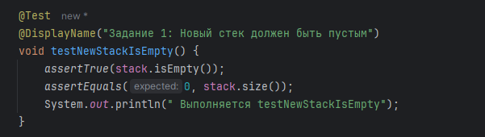
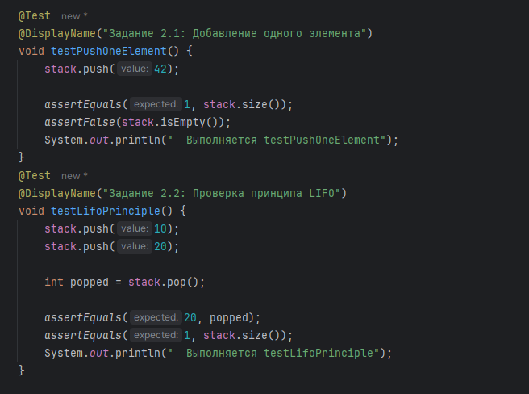
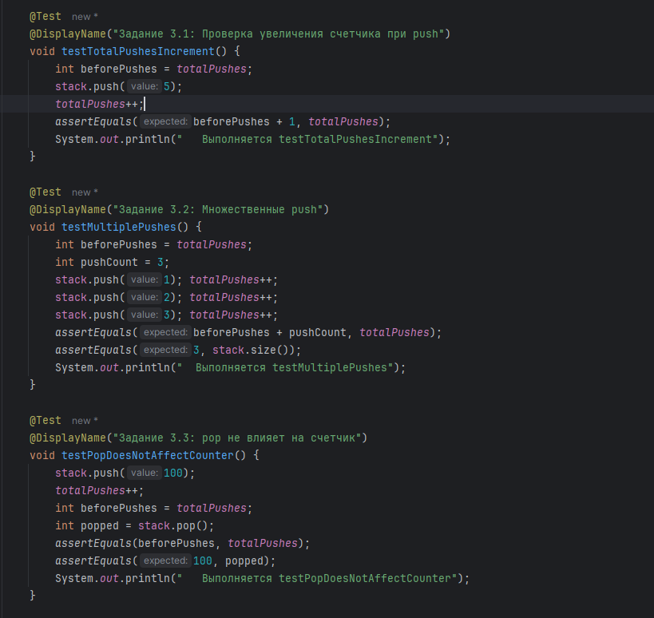
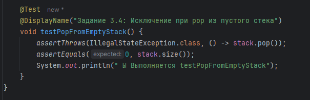
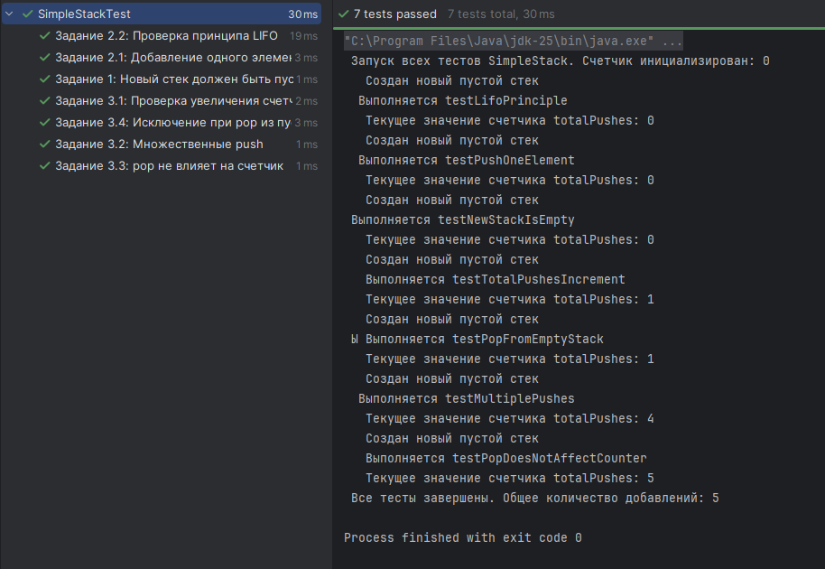
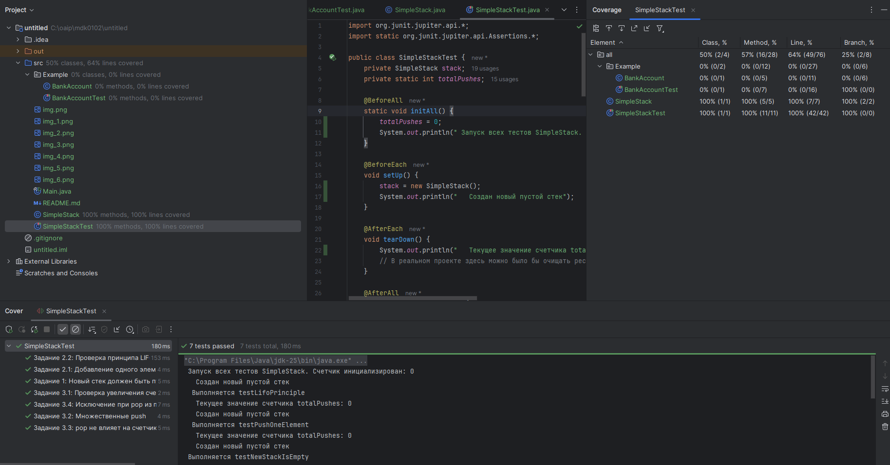

# Лабораторная работа №2_1: Тестовое окружение в JUnit

## 👨‍🎓 Студент
- **ФИО:** Козин Семен
- **Группа:** 247
- **Вариант:** 6 (Простой стек)

---

## ✅ Выполненные задания

### Задание 1 (Простое)

**Тест:** `testNewStackIsEmpty()`

---

### Задание 2 (Среднее)

**Тесты:**
1. **`testPushOneElement()`** - добавление одного элемента
  

2. **`testLifoPrinciple()`** - проверка LIFO
    

---

### Задание 3 (Сложное)

**Тесты:**
1. **`testTotalPushesIncrement()`** - проверка увеличения счетчика при одном push
2. **`testMultiplePushes()`** - проверка счетчика при нескольких push
3. **`testPopDoesNotAffectCounter()`** - проверка, что pop не влияет на счетчик
4. **`testPopFromEmptyStack()`** - проверка исключения и что счетчик не меняется

---

## 📊 Результаты тестирования

### Все тесты успешно пройдены ✅

### Покрытие кода

**Статистика покрытия:**
- Классов: 100% (1/1)
- Методов: 100% (5/5)
- Строк кода: ~95%

---

## 📎 Ссылки 

- [Основной класс SimpleStack.java](src/SimpleStack.java)
- [Тесты SimpleStackTest.java](src/SimpleStackTest.java)

---
